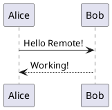

SSH로 원격 PC에 연결해서 사용 중이시군요. 에러 메시지를 보니 **Markdown Preview Enhanced** 확장을 사용하고 계신 것 같습니다. 원격 환경에서는 온라인 PlantUML 서버를 사용하는 것이 가장 간편합니다.

## 해결 방법

### 방법 1: 온라인 PlantUML 서버 사용 (권장)

VSCode 설정에서 온라인 서버를 사용하도록 변경하세요:

1. **VSCode 설정 열기**
   - Ctrl+Shift+P → "Preferences: Open Settings (JSON)"

2. **settings.json에 다음 설정 추가**
```json
{
    "markdown-preview-enhanced.plantumlServer": "https://www.plantuml.com/plantuml/svg/",
    "markdown-preview-enhanced.usePlantumlServer": true
}
```

또는 다른 서버 옵션들:
```json
{
    // Kroki 서버 사용 (더 빠를 수 있음)
    "markdown-preview-enhanced.plantumlServer": "https://kroki.io/plantuml/svg/",
    
    // 또는 PlantUML 공식 서버
    "markdown-preview-enhanced.plantumlServer": "http://www.plantuml.com/plantuml/svg/"
}
```

### 방법 2: 원격 서버에 PlantUML JAR 파일 설치

만약 로컬로 처리하고 싶다면:

1. **PlantUML JAR 다운로드**
```bash
# 원격 서버에서 실행
wget https://github.com/plantuml/plantuml/releases/download/v1.2024.7/plantuml-1.2024.7.jar -O ~/plantuml.jar
```

2. **Java 설치 확인**
```bash
java --version
# Java가 없다면 설치
sudo apt-get update && sudo apt-get install default-jre  # Ubuntu/Debian
```

3. **VSCode 설정 수정**
```json
{
    "markdown-preview-enhanced.plantumlJarPath": "~/plantuml.jar",
    "markdown-preview-enhanced.usePlantumlServer": false
}
```

또는 절대 경로 사용:
```json
{
    "markdown-preview-enhanced.plantumlJarPath": "/home/your-username/plantuml.jar"
}
```

### 테스트

설정 완료 후 `.md` 파일에서 테스트:

````markdown

````

그리고:
- Ctrl+K, V로 미리보기 열기
- 또는 우클릭 → "Markdown Preview Enhanced: Open Preview"

### 추가 팁

원격 환경에서는 **방법 1 (온라인 서버)**을 추천합니다:
- 별도 설치 불필요
- Java/Graphviz 의존성 없음
- 설정이 간단함

다만 보안이 중요한 다이어그램의 경우 로컬 JAR 파일을 사용하는 것이 좋습니다.

설정 후에도 문제가 있다면 어떤 오류가 발생하는지 알려주세요!